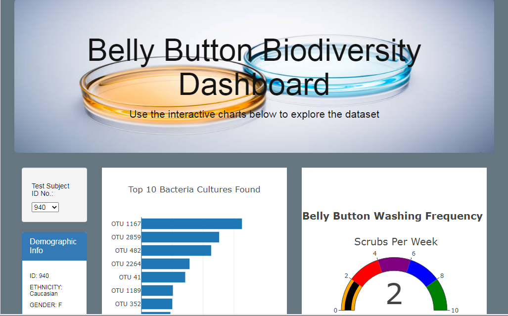

# plotlydiploy
Plotly &amp; Belly Button Biodiversity

Working Scripted Web Page @:

https://sardcat.github.io/plotlydiploy/

## Overview
Is there beef hiding in your belly button? A single web page bringing JavaScript & Plotly visualizations to explore and showcase a 2016 study of bacteria hiding in participants navels.

Fig 1.) Web Page Example.

